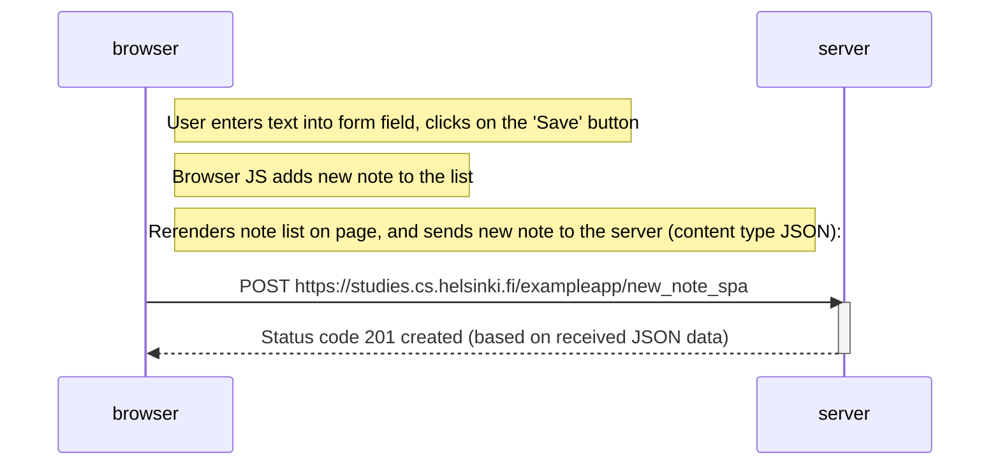

```mermaid
sequenceDiagram
    participant browser
    participant server

	Note right of browser: User enters text into form field, clicks on the 'Save' button
	
	Note right of browser: Browser JS adds new note to the list
	
	Note right of browser: Rerenders note list on page, and sends new note to the server (content type JSON):

    browser->>server: POST https://studies.cs.helsinki.fi/exampleapp/new_note_spa
    activate server
    server-->>browser: Status code 201 created (based on received JSON data)
    deactivate server
	
```